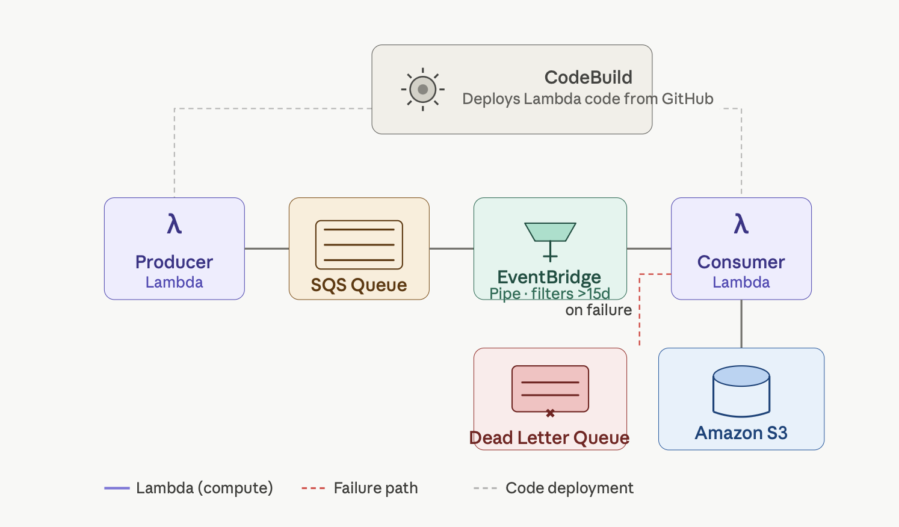

# Event-Driven Booking Data Pipeline — AWS

An event-driven data pipeline that ingests, filters, and stores booking records using serverless AWS services. Lambda code is automatically deployed from GitHub via AWS CodeBuild.

## Architecture



## Pipeline flow
Producer Lambda → SQS Queue → EventBridge Pipe (filter) → Consumer Lambda → S3
↓ (on failure)
Dead Letter Queue

## How it works

1. **Producer Lambda** generates booking records and publishes them to an SQS queue
2. **EventBridge Pipe** reads from SQS and filters out bookings with duration greater than 15 days — no custom code, handled via pipe configuration
3. **Consumer Lambda** receives filtered records and stores them as CSV files in S3
4. If the Consumer Lambda fails 3 consecutive times, the message is moved to a **Dead Letter Queue** for inspection
5. **AWS CodeBuild** watches this GitHub repo — any commit automatically redeploys the Lambda functions via `buildspec.yml`

## Tech stack

| Service | Purpose |
|--------|---------|
| AWS Lambda | Producer and consumer logic |
| Amazon SQS | Message queuing with DLQ |
| EventBridge Pipes | Serverless filtering — no code |
| Amazon S3 | Storage for processed records |
| AWS CodeBuild | Deploys Lambda code from GitHub |
| Python | Lambda function logic |

## Sample record

```json
{
  "bookingId": "550e8400-e29b-41d4-a716-446655440000",
  "userId": "user123",
  "propertyId": "prop456",
  "location": "Barcelona, Spain",
  "startDate": "2025-04-01",
  "endDate": "2025-04-05",
  "price": 450
}
```

## Project structure## How it works

1. **Producer Lambda** generates booking records and publishes them to an SQS queue
2. **EventBridge Pipe** reads from SQS and filters out bookings with duration greater than 15 days — no custom code, handled via pipe configuration
3. **Consumer Lambda** receives filtered records and stores them as CSV files in S3
4. If the Consumer Lambda fails 3 consecutive times, the message is moved to a **Dead Letter Queue** for inspection
5. **AWS CodeBuild** watches this GitHub repo — any commit automatically redeploys the Lambda functions via `buildspec.yml`

## Tech stack

| Service | Purpose |
|--------|---------|
| AWS Lambda | Producer and consumer logic |
| Amazon SQS | Message queuing with DLQ |
| EventBridge Pipes | Serverless filtering — no code |
| Amazon S3 | Storage for processed records |
| AWS CodeBuild | Deploys Lambda code from GitHub |
| Python | Lambda function logic |

## Sample record

```json
{
  "bookingId": "550e8400-e29b-41d4-a716-446655440000",
  "userId": "user123",
  "propertyId": "prop456",
  "location": "Barcelona, Spain",
  "startDate": "2025-04-01",
  "endDate": "2025-04-05",
  "price": 450
}
```

## Project structure
